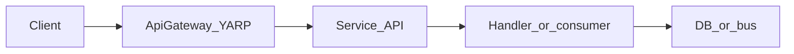

# 00 — Mindset and navigation

Large repositories are not read like a novel. You **thread** one user-visible behavior through the code, then widen the circle only when needed.

## Core habits

1. **Pick one stimulus** — one HTTP call, one message, or one UI action. Everything else is background noise until that thread is understood.
2. **Read top-down** — route / minimal API → MediatR command or query → handler → infrastructure (DB, gRPC, bus). Stop when the next layer is a new bounded context; note the dependency and move on.
3. **Write a one-line log for yourself** — after each session, one sentence: “Create booking calls Flight + Passenger over gRPC, then writes to EventStore.” That sentence is your map.
4. **Prefer “why here?” over “what is every file?”** — folder structure becomes obvious after several slices.

## How to move inside this solution

| Technique | Use it for |
|-----------|------------|
| **Jump to definition** (F12) on types used in the slice | Following `IMediator`, gRPC clients, repository interfaces |
| **Find all references** (Shift+F12) on a command or endpoint class | Seeing tests and registrations |
| **Solution search** by symbol name (e.g. `CreateBooking`) | Locating the vertical slice folder quickly |
| **Scoped search** — limit search to `src/Services/Booking` first | Avoiding noise from other services |

This repo uses **vertical slice** layout: feature code often lives under a path like `Features/<FeatureName>/V1/` with endpoint, validator, and handler together. Example:

[`src/Services/Booking/src/Booking/Booking/Features/CreatingBook/V1/CreateBooking.cs`](../src/Services/Booking/src/Booking/Booking/Features/CreatingBook/V1/CreateBooking.cs)

## When to stop (anti-burnout)

Stop a session when you can answer:

- What URL or message started the flow?  
- What is the **next** major component (service or store) this flow touches?  
- What would you **grep** next time to get back here in under a minute?

If you cannot answer those three, you went too wide; zoom back to the entry file and one callee.

## Mental model: one request

You will add observability on top of this picture in [04 — Observability loop](./04-observability-loop.md).

## Screenshot placeholder

Optional: add a photo of your IDE layout (solution explorer + vertical slice file) here.

<!--  -->

## Next step

Continue to [01 — Environment and run](./01-environment-and-run.md).
