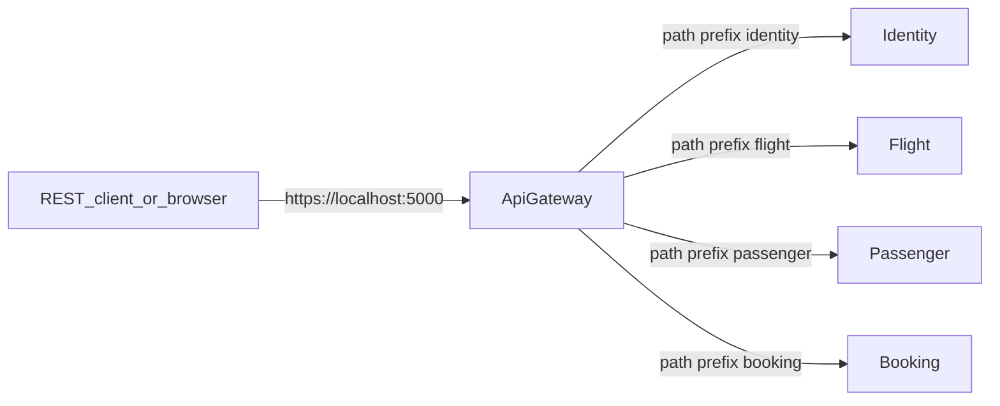

# 02 — System map (one page)

This document is **read-only orientation**. Do not try to run or change everything here; just build a coarse map.

## Bounded contexts (services)

The [README](../README.md) describes the domain split. At a high level:

| Service | Role (simplified) |
|---------|-------------------|
| **Identity** | Authentication (Duende IdentityServer), users, API scopes |
| **Flight** | Flights, seats, airports, aircraft — **write model** in Postgres, read side in Mongo (see service docs in code) |
| **Passenger** | Passenger registration and profiles |
| **Booking** | Reservations; **EventStoreDB** for booking aggregate; gRPC to Flight and Passenger |
| **ApiGateway** | **YARP** reverse proxy; single entry URL for browser or REST client |

Kubernetes manifests exist under [`deployments/kubernetes/`](../deployments/kubernetes/). This learning path does **not** cover applying or debugging them; you may skim the folder later only if your job requires it.

## How traffic enters

YARP matches path prefixes and strips them before forwarding. Configuration lives in [`src/ApiGateway/src/appsettings.json`](../src/ApiGateway/src/appsettings.json):

- Route `booking/{**catch-all}` → cluster `booking` → `http://localhost:6010` (local)  
- Same pattern for `flight`, `passenger`, `identity`

Docker overrides are in [`src/ApiGateway/src/appsettings.docker.json`](../src/ApiGateway/src/appsettings.docker.json) (container DNS names).

## API shape

- Versioned REST paths use [`BaseApiPath`](../src/BuildingBlocks/Web/EndpointConfig.cs): `api/v{version:apiVersion}/...`  
- Example: **Create booking** → `POST /booking/api/v1/booking` through the gateway (prefix `booking` + service route).

## Discovering endpoints

Per [README](../README.md):

- Swagger: `/swagger`  
- Scalar: `/scalar/v1`  

Try on the gateway URL or directly on a service port while learning.

## HTTP samples in-repo

[`booking.rest`](../booking.rest) is a practical catalog of calls (REST Client extension in VS Code). Variables at the top point at gateway and services.

## Internal communication

- **Booking → Flight / Passenger**: gRPC (see `Grpc` section in [`src/Services/Booking/src/Booking.Api/appsettings.json`](../src/Services/Booking/src/Booking.Api/appsettings.json)).  
- **Async integration**: RabbitMQ with MassTransit (outbox/inbox patterns — deep dive optional).

## Where OpenTelemetry fits

Shared instrumentation is wired through **BuildingBlocks** and service `Program` / infrastructure extensions. You will use this in [04](./04-observability-loop.md); no need to master it on first read.

## Screenshot placeholder

Optional: paste a Scalar or Swagger page for one service.

<!--  -->

## Next step

[03 — First flow: Create booking](./03-first-flow-booking-create.md)
