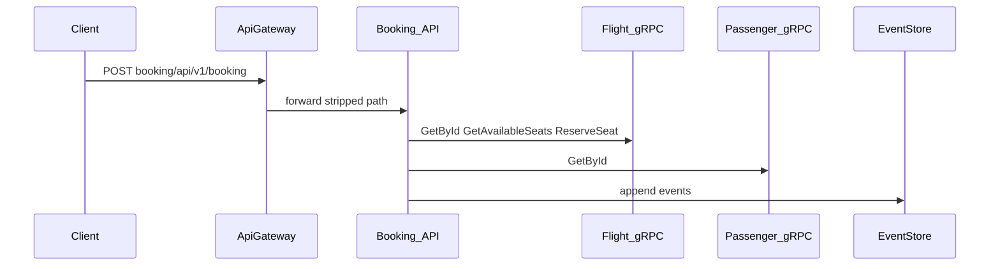

# 03 — First flow: Create booking

This is the **main capstone** for your first learning cycle: one write operation that touches **gateway → booking → gRPC (flight, passenger) → EventStore → messaging/seat reservation**.

## Warm-up (optional, same day or day before)

If you want a **smaller** read first, open **Get flight by id**:

- Code: [`src/Services/Flight/src/Flight/Flights/Features/GettingFlightById/V1/GetFlightById.cs`](../src/Services/Flight/src/Flight/Flights/Features/GettingFlightById/V1/GetFlightById.cs)  
- HTTP (via gateway): see `Get_Flight_By_Id` in [`booking.rest`](../booking.rest)

You still need a **Bearer token** with the **flight-api** scope for that call. Then return here for Create booking.

## The HTTP contract

Through the API gateway (HTTPS in local samples):

```http
POST https://localhost:5000/booking/api/v1/booking
Authorization: Bearer <access_token>
Content-Type: application/json

{
  "passengerId": "<guid>",
  "flightId": "<guid>",
  "description": "string"
}
```

Same request appears as `Create_Booking` in [`booking.rest`](../booking.rest).

## Authorization (important)

The endpoint uses `.RequireAuthorization(nameof(ApiScope))`. The policy is defined in [`src/BuildingBlocks/Jwt/JwtExtensions.cs`](../src/BuildingBlocks/Jwt/JwtExtensions.cs): the access token must include a **`scope`** claim that contains this service’s **audience**.

For Booking, [`appsettings.json`](../src/Services/Booking/src/Booking.Api/appsettings.json) sets `"Audience": "booking-api"`.

So your token request must ask for the **`booking-api`** scope (Identity registers it in [`src/Services/Identity/src/Identity/Configurations/Config.cs`](../src/Services/Identity/src/Identity/Configurations/Config.cs)).

Example token request (password grant — same client as `booking.rest`, adjust **scope**):

```http
POST https://localhost:5000/identity/connect/token
Content-Type: application/x-www-form-urlencoded

grant_type=password
&client_id=client
&client_secret=secret
&username=samh
&password=Admin@123456
&scope=openid profile booking-api role
```

The sample `Authenticate` request in `booking.rest` uses `scope=flight-api role`; **that is not enough** for Create booking. Either add a separate token request with `booking-api`, or widen the scope line to include `booking-api` when you work on booking flows.

## Data you need

Create booking validates **PassengerId** and **FlightId** and loads both over gRPC. You need IDs that **exist** in your database (seed data, migrations, or records you created via Flight/Passenger APIs).

`booking.rest` includes example GUIDs (`@flightid`, `@passengerId`). If those do not exist in your environment, create flights and passengers first using the same file’s Flight and Passenger sections (with a token that includes **flight-api** / **passenger-api** scopes as needed).

## Read the vertical slice (top-down)

Open a single file and navigate outward only when needed:

**Entry file** — [`CreateBooking.cs`](../src/Services/Booking/src/Booking/Booking/Features/CreatingBook/V1/CreateBooking.cs)

| Piece in file | What to notice |
|---------------|----------------|
| `CreateBookingEndpoint` | `MapPost`, route under [`BaseApiPath`](../src/BuildingBlocks/Web/EndpointConfig.cs), MediatR `Send` |
| `CreateBookingValidator` | FluentValidation rules |
| `CreateBookingCommandHandler` | gRPC calls to Flight and Passenger, seat lookup, `IEventStoreDBRepository`, domain events, `ReserveSeatAsync` |

Questions to answer after reading:

1. What happens if the flight or passenger is missing?  
2. Where is the booking aggregate created (domain method)?  
3. What external calls happen **after** the aggregate is built?

## End-to-end flow (mental diagram)



## Execute the flow

1. Start the stack ([01](./01-environment-and-run.md)).  
2. Obtain a token with **`booking-api`** scope.  
3. Ensure valid `flightId` and `passengerId`.  
4. Send `Create_Booking` from `booking.rest` or curl.  
5. Expect `200` and a response body with a booking identifier.

If you get **401**, fix token audience/scope. If you get **404 or business exception**, fix IDs or upstream data.

## Screenshot placeholder

<!--  -->

## Next step

Run the same request again while you follow [04 — Observability loop](./04-observability-loop.md) to see it in traces and metrics.
