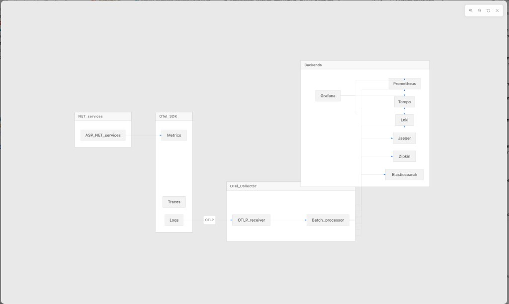

# 04 — Observability loop

Goal: **repeat the same request** you studied in [03](./03-first-flow-booking-create.md) and **match** UI (Aspire or Grafana) to code (spans, service names, dependencies).

## Big picture (reference diagram)

## Two good UIs for learning

### 1) Aspire dashboard (fastest feedback)

When you use `aspire run`, open **`http://localhost:18888`** (from [launchSettings](../src/Aspire/src/AppHost/Properties/launchSettings.json)).

Use it to see:

- Which projects are running  
- Structured logs and traces for recent requests  
- Resource health

This is the **lowest friction** way to confirm “my Create booking call hit booking-service and called something slow.”

### 2) Grafana + backends (closer to production)

Aspire also starts **Grafana**, **Prometheus**, **Tempo**, **Loki**, **Jaeger**, **Zipkin**, and the **OpenTelemetry Collector** per [`AppHost/Program.cs`](../src/Aspire/src/AppHost/Program.cs).

| Tool | Typical URL (Aspire host ports) | Login |
|------|----------------------------------|-------|
| Grafana | `http://localhost:3000` | `admin` / `admin` |
| Prometheus | `http://localhost:9090` | — |
| Jaeger | `http://localhost:16686` | — |
| Zipkin | `http://localhost:9411` | — |

**Datasources** Grafana uses are provisioned in [`deployments/configs/grafana/provisioning/datasources/datasource.yml`](../deployments/configs/grafana/provisioning/datasources/datasource.yml) (Prometheus, Tempo, Loki, Jaeger, Zipkin, Elasticsearch).

### Docker Compose equivalents

If you used [`deployments/docker-compose/docker-compose.yaml`](../deployments/docker-compose/docker-compose.yaml), the same **Grafana / Prometheus / Jaeger / Zipkin / Loki** URLs apply on `localhost` with ports defined in that file (Grafana `3000`, Prometheus `9090`, and so on). Collector OTLP is on **`4317`** / **`4318`**.

## What the collector does

Read [`deployments/configs/otel-collector-config.yaml`](../deployments/configs/otel-collector-config.yaml) at a high level:

- **Receivers**: OTLP (gRPC + HTTP)  
- **Processors**: `batch`  
- **Pipelines**: traces → Jaeger, Zipkin, Tempo (+ `debug`); metrics → Prometheus remote write + Prometheus exporter; logs → Loki OTLP + Elasticsearch

You do not need to change this file to learn; reading the `service.pipelines` section is enough.

## Exercise — close the loop

1. **Trigger** Create booking once ([03](./03-first-flow-booking-create.md)).  
2. In **Aspire**, find the trace or log lines for `booking-service` around that timestamp.  
3. In **Grafana → Explore**, select **Tempo** (or **Jaeger**) and search by service name or trace id if you copied one from logs.  
4. On the trace timeline, identify:
   - inbound HTTP span  
   - outbound gRPC spans to Flight and Passenger  
   - any database-related spans (Npgsql instrumentation)  
5. **Optional metrics**: Booking API exposes Prometheus scraping when enabled (see [`ObservabilityOptions`](../src/BuildingBlocks/OpenTelemetryCollector/ObservabilityOptions.cs) and [`Extensions.cs`](../src/BuildingBlocks/OpenTelemetryCollector/Extensions.cs) for `/metrics` and OTLP). In Prometheus UI, try a query on `http` or process metrics if you see series for `booking_service`.

## Map spans back to code

Instrumentation and behaviors live under:

- [`src/BuildingBlocks/OpenTelemetryCollector/`](../src/BuildingBlocks/OpenTelemetryCollector/) — registration, MediatR pipeline behavior, tags  
- Service `InfrastructureExtensions` (e.g. Booking) wires the building block

When you see a span named like a MediatR command, open **`ObservabilityPipelineBehavior`** and the command handler you already read in Create booking.

## Screenshot placeholders

Paste your own captures below as you learn (save files under [`assets/`](./assets/)).

<!--  -->

<!--  -->

## When metrics look empty

- Confirm the stack that exports OTLP is running **collector** and that apps point OTLP to the same host/port your run mode uses.  
- Confirm you generated traffic **after** Grafana/Prometheus were up.

## Next step

If you need to **verify rows or streams**, continue to [05 — Databases and data](./05-databases-and-data.md). Otherwise jump to [06 — Add a small feature](./06-add-a-small-feature.md).
