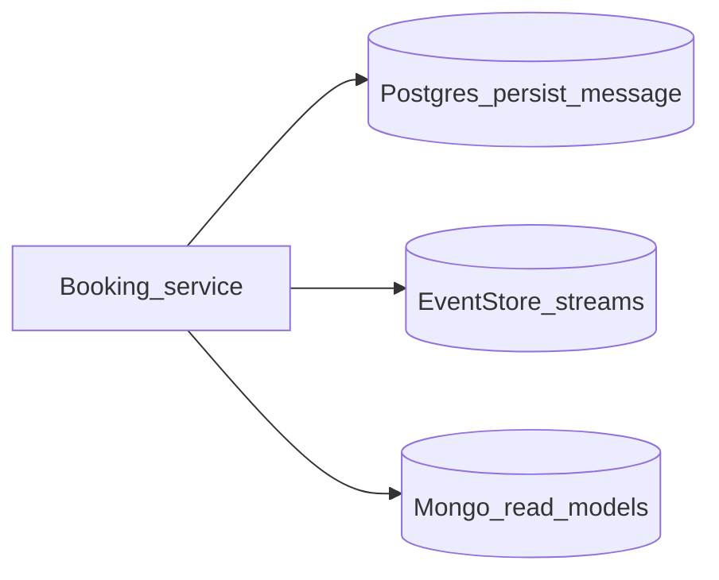

# 05 — Databases and data

Goal: when you run a flow, know **where to look** to prove data landed — without becoming a DBA.

## Strategy

1. Start from the **service you called** (Booking for Create booking).  
2. Open that service’s `appsettings.json` (or `appsettings.docker.json` if running in Compose).  
3. Read **connection strings** and database names.  
4. Use a **desktop client** (pgAdmin, Azure Data Studio, MongoDB Compass) or `docker exec` into the DB container only if you are comfortable.

Not every store updates on the first request; use traces first, then open the store your handler actually touches.

## Postgres (relational / outbox-style persistence)

Default pattern in local `appsettings.json`: `Server=localhost;Port=5432;User Id=postgres;Password=postgres`.

| Service | Example database name (from appsettings) |
|---------|-------------------------------------------|
| Identity | `identity` |
| Flight | `flight` |
| Passenger | `passenger` |
| All (shared outbox DB name) | `persist_message` in `PersistMessageOptions` |

Sources:

- [`src/Services/Identity/src/Identity.Api/appsettings.json`](../src/Services/Identity/src/Identity.Api/appsettings.json)  
- [`src/Services/Flight/src/Flight.Api/appsettings.json`](../src/Services/Flight/src/Flight.Api/appsettings.json)  
- [`src/Services/Passenger/src/Passenger.Api/appsettings.json`](../src/Services/Passenger/src/Passenger.Api/appsettings.json)  
- Booking uses Postgres only for persist-message (see Booking `appsettings.json`).

**Compose**: Postgres is published on host port **5432** per [`docker-compose.yaml`](../deployments/docker-compose/docker-compose.yaml).

## MongoDB (read models)

Connection string is typically `mongodb://localhost:27017` with a per-service database name:

| Service | `DatabaseName` (example) |
|---------|--------------------------|
| Flight | `flight-db` |
| Passenger | `passenger-db` |
| Booking | `booking-db` |

## EventStoreDB (booking write side)

Booking uses `EventStoreOptions` in [`src/Services/Booking/src/Booking.Api/appsettings.json`](../src/Services/Booking/src/Booking.Api/appsettings.json), for example `esdb://localhost:2113?tls=false`.

**Compose / Aspire**: HTTP is exposed on **2113**. You can open the EventStore web UI in a browser at `http://localhost:2113` for a visual stream browser (useful after you understand stream naming in the Booking module).

## Elasticsearch and Kibana (logs)

Serilog and central log stacks are part of the broader solution. For this learning path, **prefer Loki in Grafana** (see [04](./04-observability-loop.md)) unless you already use Kibana. Elasticsearch ports are defined in Compose and Aspire AppHost if you need them later.

## Practical checks after Create booking

| Question | Where to look |
|----------|----------------|
| Did Booking talk to Flight/Passenger? | Trace in Tempo/Jaeger ([04](./04-observability-loop.md)) |
| Did a stream get an event? | EventStore UI, stream ids depend on aggregate id (Create booking uses `command.Id` as booking id) |
| Did read model or projection update? | Mongo `booking-db` (after consumers run) — **later** topic; do not block on it in week one |

## Screenshot placeholder

<!--  -->

## Next step

[06 — Add a small feature](./06-add-a-small-feature.md)
